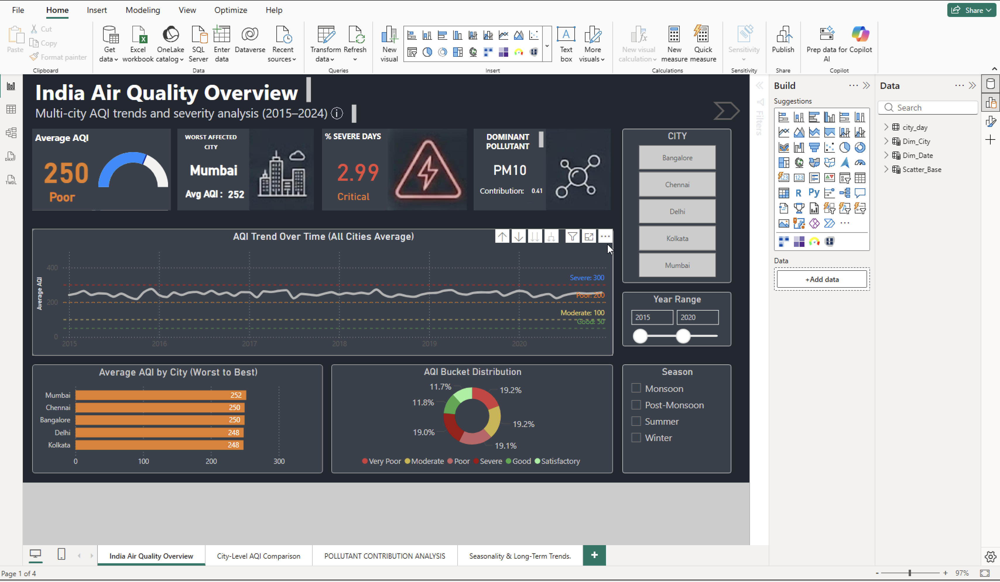
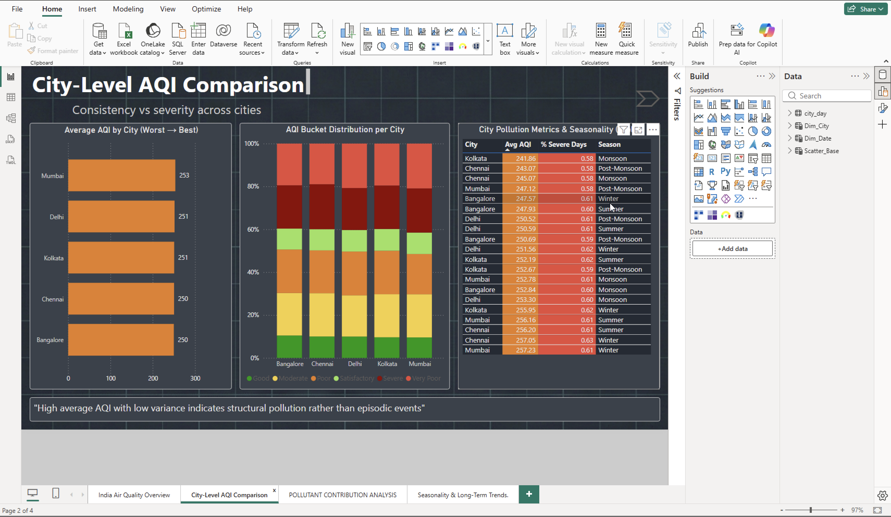
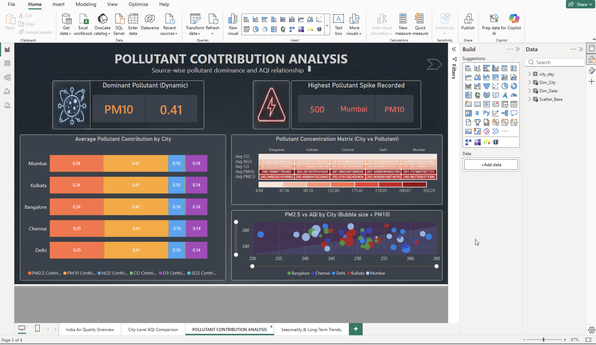
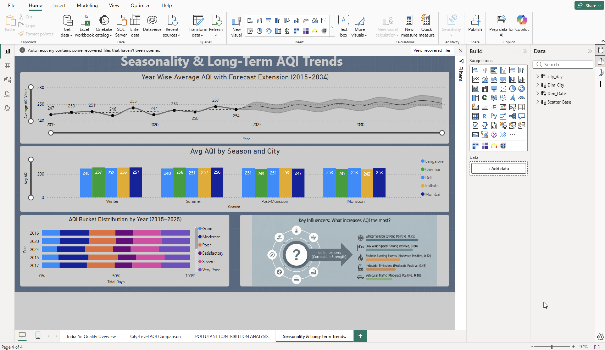

# 🇮🇳 India Air Quality Analytics Dashboard (2015–2024)

An interactive **Power BI dashboard** built to analyze Air Quality Index (AQI) data across major Indian cities from **2015 to 2024**. The dashboard transforms raw environmental data into actionable insights through interactive visualizations, DAX measures, and data modeling.

---

## 📖 Project Overview

The dashboard provides comprehensive insights into India's air quality by analyzing:

- City-wise AQI performance
- Seasonal pollution trends
- Dominant pollutant analysis
- Long-term AQI trends
- AQI bucket distribution
- Pollutant contribution across cities
- Interactive filtering and drill-down analysis

---

## 🚀 Key Features

- 📊 Interactive Power BI Dashboard
- 🏙️ City-wise AQI Comparison
- 📈 Year-wise AQI Trend Analysis
- 🌦️ Seasonal AQI Analysis
- 🌫️ Pollutant Contribution Analysis
- 📌 KPI Cards
- 🔍 Interactive Slicers & Filters
- 📉 AQI Forecasting
- 📊 Heatmaps, Bubble Charts & Stacked Charts

---

# 📊 Dashboard Pages

## 1. India Air Quality Overview

Provides a high-level overview of air quality across India.

### Highlights
- Average AQI
- Worst Affected City
- Dominant Pollutant
- Severe AQI Percentage
- AQI Trend Over Time
- AQI Bucket Distribution
- Interactive City, Season & Year Filters

### Preview



---

## 2. City-Level AQI Comparison

Compares pollution levels across major Indian cities.

### Highlights
- Average AQI by City
- AQI Bucket Distribution
- Seasonal Pollution Metrics
- Interactive Pollution Table

### Preview



---

## 3. Pollutant Contribution Analysis

Analyzes the impact of different pollutants on AQI.

### Highlights
- Dominant Pollutant
- Highest Pollution Spike
- Pollutant Contribution by City
- Pollution Heatmap
- PM2.5 vs AQI Bubble Analysis

### Preview



---

## 4. Seasonality & Long-Term Trends

Explores seasonal variations and long-term AQI trends.

### Highlights
- Year-wise AQI Trend
- AQI Forecast (2025–2034)
- Seasonal AQI Comparison
- AQI Bucket Distribution
- Key Pollution Influencers

### Preview



---

# 🛠️ Tech Stack

- **Power BI Desktop**
- **Power Query**
- **DAX**
- **Data Modeling**
- **Microsoft Excel**

---

# 📂 Dataset

The dashboard is built using historical Air Quality Index (AQI) data containing:

- City
- Date
- AQI
- AQI Bucket
- PM2.5
- PM10
- NO₂
- SO₂
- CO
- O₃

---

# 📈 Skills Demonstrated

- Data Cleaning
- Data Transformation
- Data Modeling
- DAX Calculations
- Dashboard Development
- Data Visualization
- KPI Design
- Forecasting
- Trend Analysis
- Business Intelligence

---

# 🎯 Project Objective

To analyze historical Air Quality Index (AQI) data using Power BI and transform raw environmental data into meaningful insights through interactive dashboards. The project enables users to monitor pollution trends, compare cities, identify dominant pollutants, and study seasonal as well as long-term air quality patterns.

---

# 📁 Repository Structure

```
Power-BI-Project-India-Air-Quality-Analysis-2015-2024/
│
├── India_Air_Quality_Analytics_Dashboard.pbix
├── city_day.csv
├── overview.png
├── city-comparison.png
├── pollutant-analysis.png
├── seasonality-trends.png
└── README.md
```

---

# 💡 Future Improvements

- Add real-time AQI data integration
- Publish dashboard to Power BI Service
- Include more Indian cities
- Add predictive machine learning models
- Integrate weather and meteorological data

---

# 👨‍💻 Author

**Shaan Mohammad**

- GitHub: https://github.com/Shaan-Mohammad

---

## ⭐ Support

If you found this project useful, consider giving it a ⭐ on GitHub.
